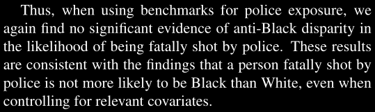
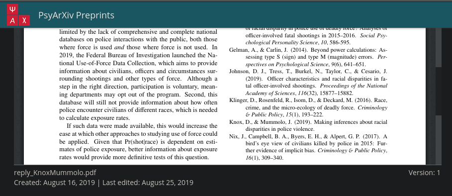
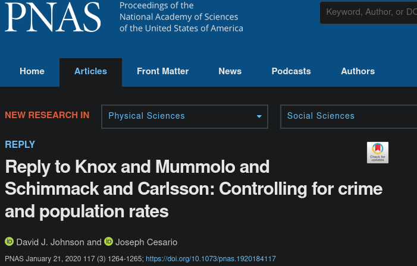
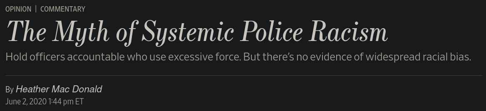

# Proof

The quote appears in the preprint found [here](https://psyarxiv.com/dmhpu/).

However, the quote doesn't appear in the [published version](https://www.pnas.org/content/117/3/1264).

The timeline of publications shows that the published work was available (and had been several months) when the WSJ piece was published.

## Preprint Version: August 16, 2019

## Published Version: January, 21, 2020

## WSJ op-ed: June 2, 2020

# Title Ideas

Heather Mac Donald took a quote from a pre-print letter that does not appear in published work and cited it as if it were research.

Heather Mac Donald took a quote from a pre-print letter that did not make it to publication and presented it as published research.

Heather Mac Donald took a quote that did not make it to publication from a pre-print and presented it as if it were published research.

### Commentary Versions
> Heather Mac Donald quoted a passage of a pre-print that does not appear in the final work and presented it as if it were published research

### Strictly Facts Version:

Fact Check: The Quote Heather Mac Donald presents when discussing Johnson, et al comes from a passage of a pre-print that does not appear in the published work.
